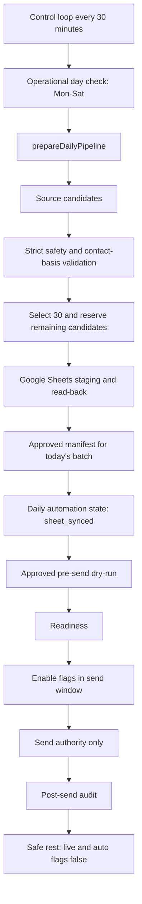

# Gmail Daily Sales Pipeline Recovery

Date: 2026-06-29

## Authority

- Scheduler controller: `runGmailSalesProductionControlLoop`
- Send authority: `runGmailSalesDailyAutomationTrigger`
- `runScheduledDailySend` remains monitor-only.
- `MailApp.sendEmail` must remain a single call site.

## Daily Pipeline

## Blocked Reason Remediation

| Reason | Automatic handling |
| --- | --- |
| `selected_count_not_30` | Reload source and rebuild selected set during prepare window only. |
| `state_not_sheet_synced` | Regenerate state only after Sheet commit and read-back pass. |
| `state_target_date_mismatch` | Regenerate today's state during prepare. |
| `manifest_target_date_mismatch` | Regenerate today's manifest during prepare. |
| `manifest_batch_mismatch` | Regenerate manifest from today's batch ID. |
| `manifest_candidate_count_not_30` | Regenerate only if Sheet selected rows are exactly 30. |
| `manifest_max_send_count_not_30` | Regenerate manifest with max send count 30. |
| `manifest_expired` | Regenerate only inside the same operational day prepare window. |
| `candidate_digest_mismatch` | Recalculate from Sheet read-back; block if still mismatched. |
| suppression/history/duplicate/content/contact-basis failures | Block. Do not auto-bypass. |

## Contact Basis

Candidates must have a valid internal contact basis before selection:

- `contactBasisType`
- `contactBasisRecordedAt`
- `sourceType`
- `sourceReferenceHash`
- `optOutAvailable`
- `lastVerifiedAt`
- `suppressionCheckedAt`
- `historyCheckedAt`

Allowed basis types are intentionally narrow:

- `existing_relationship`
- `explicit_opt_in`
- `valid_business_contact_exception`
- `manual_legal_reviewed`

Unknown or guessed basis values are not selected.

## Production Deployment Steps

1. Copy the updated `apps-script/gmail-sales-automation/Code.gs` into Apps Script and save.
2. Do not run a send function immediately.
3. Run `inspectGmailSalesDeploymentReadiness`.
4. Confirm `deploymentReady=true` and no blocked reasons.
5. Run `inspectGmailSalesProductionTriggers`.
6. If needed, run `installGmailSalesProductionTriggersOnce` once.
7. Confirm only `runGmailSalesProductionControlLoop` is scheduled every 30 minutes.
8. Let the control loop perform prepare, readiness, enable, send, audit, and safe rest.

## Manual Status Check

Use `inspectGmailSalesCurrentOperationalStatus`.

Recommended action values are safe enumerations:

- `wait_for_control_loop`
- `prepare_retry_available`
- `manual_prepare_review_required`
- `ready_wait_for_enable`
- `ready_wait_for_send_window`
- `send_in_progress`
- `audit_pending`
- `complete`
- `blocked_human_review`

## Safe Rest

After send or blocked send completion:

- `AUTOMATION_MASTER_ENABLED` may remain true for the control loop.
- `AUTO_SEND_ENABLED=false`
- `LIVE_SEND_ENABLED=false`

## Do Not Do

- Do not repeatedly run the send authority manually.
- Do not bypass suppression, sent history, replies, opt-out, or contact-basis checks.
- Do not retry `DELIVERY_UNKNOWN`.
- Do not retry `SEND_RESERVED` rows without human investigation.
- Do not use old manifests for a new operating day.
- Do not send on Sunday. Sunday is reserved for `runGmailSalesWeeklyReportAndOptimization`.
